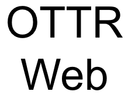

<div class = "banner_color">
Banner text!  
</div>

Adding text for a practice PR to merge

### **About**

This website was created with the OTTR_Template_Website template. This enables simpler creation of websites that have automated checks for broken URLs and spelling errors, as well as automated rendering of all html files. **This change is testing whether or not render will work when a change hits main.** 

I've added the robot as a collaborator too. Not sure why I was getting the actions error I was seeing otherwise. The error was not the bot. I needed to enable actions workflow permissions in settings. `Settings -> Action -> General -> Workflow permissions and choose read and write permissions`

Trying to have the base preview GitHub Action install docker directly. And trying it again a different way. And again trying another way. Eventually I'll get it to install or recognize docker.

This time I'm not even trying to install docker. I noticed that the action only deletes the docs folder if preview is set to false, so seeing what happens if we don't have that.

Another edit to re-trigger rendering -- I've decided it might be a workflow file issue and not a preview issue because the pull request log doesn't show grabbing a container until docker realizes it doesn't have one. The render log shows pulling a container much earlier, and then doesn't seem to have access to it. So I moved the image from the render-site down to with: docker_image: for the run render step itself.

Here is how you can include images in your website pages (this one is saved in `resources/images` to keep things tidy:

```{r, fig.align='center', fig.alt= "Example image", echo = FALSE, out.width="30%"}

```

 
 
We will go through the following:

1. How to set up your repository to enable the GitHub actions of the template. (Setup tab)
2. How to host your website using GitHub (Hosting tab)
3. How to modify your website structure (Structure tab)
4. How to change your website style (Style tab)
5. More information about GitHub Actions (Git Actions tab)

Click on each tab to learn more.


